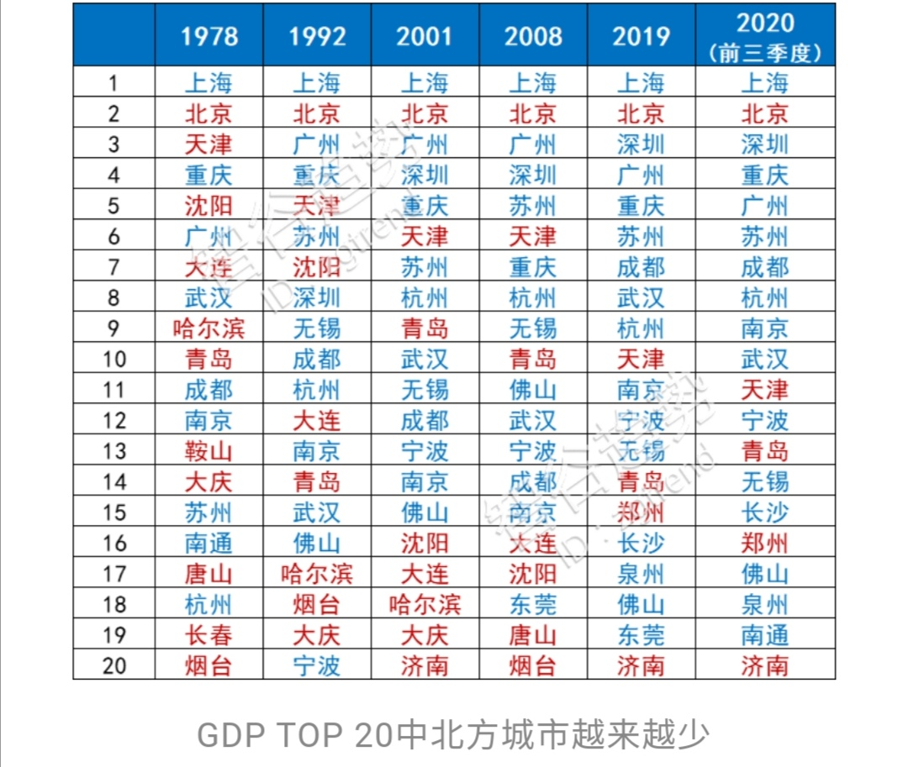
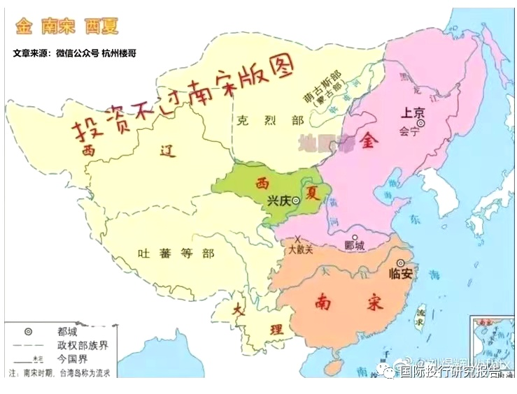
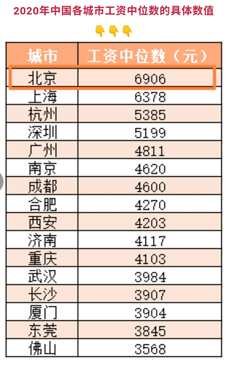

* 投资不过南宋

2019年我国GDP总量前十北方只有北京和天津在苦苦支持，而今年天津的地位也是摇摇欲坠，有这么一种说法, 投资不过南宋。两宋时期，我国经济重心就在南移，就算明朝朱棣迁都燕京，也只是形成北方政治中心和南方经济中心的基本格局。

 

* 某媒体统计2020年主要城市工资的中位数

知乎的人均985年薪百万的可信度没那么高，李总理曾公布国家统计局的数据超过6亿人的月薪不到1k。当然可能A月薪15k，房贷9k，还交房租，而同事B月薪8k，有自住房。这就是另一个纬度的话题了。

* "请善待身边吸烟的人"

吸烟对人体的伤害性，需要连续吸烟二三十年才能体现出来，也就是60岁之后，大概会早10年左右。这意味着烟民平均少拿10年的退休金。
  
从政府财政来说，若是一个人在工作期间努力缴纳大量退休金，但退休后就去世，这类短寿公民便为财政做了净贡献。不影响壮劳力的身体，但是能够有效缩短老年人的寿命，这种神器简直是老龄化社会和社保基金的最爱。从中国经济大盘来说，香烟创造的财政收入远不止每年一万亿，他还同时减少了养老金以及医疗支出。

  ———— 摘自《首席商业评论》
  

* [教育部称「招聘中不得将毕业院校、全日制作为限制性条件」，在实施过程中该如何落实?](https://www.zhihu.com/question/432880029/answer/1607390298])

* 浙江规定省级单位3度以下才能开空调

 北方人的集中供暖，得益于煤炭的廉价和充足供应。而南方缺煤，冬天使用电力供暖本质上意味着极大的能源成本。我国大部分的电力还是通过燃煤发电。
 伦敦有个地质数据显示，无论地表温度如何变化，伦敦地下超过十米深处，温度常年保持在15摄氏度左右。理论上通过与地底的热交换，可以让室温常年保持在15摄氏度左右。发达国家通过这项地源热泵技术，将暖气片与地下的能源桩相结合，取得了良好的节能效果。

* 一个数学概率问题

节目有一个竞猜游戏，在参与者面前有三扇关闭的门，其中一扇门后面是法拉利跑车，另外两个门后面是自行车。节目主持人知道哪个门后面有什么，参与者不知情。参与者选择其中一个门后，主持人会从剩下的两个门中拿走一个背后是自行车的门，参与者有一次换门的机会，问参与者换门和不换门的中奖概率分别是多少？
  这就是经典的三门问题，也称亦称为蒙提霍尔问题、蒙特霍问题或蒙提霍尔悖论。答案在逻辑上并不矛盾，但是十分违反人的直觉。

- 如何理解区块链
 近日辽宁沈阳某小区大门为禁止外来车辆出入，自发用66把锁头接连挂起，组合成简易的“门禁系统”。小区车主只需拿钥匙打开对应的锁头，就能打开大门。这一举措完美诠释了区块链，是区块链技术实体化，主要特点体现：去中心化（不需要统一管理，每把锁只要有对应钥匙即可打开大门）、可追溯性（谁没锁找谁）、不可篡改性（一人一锁一钥匙）。
