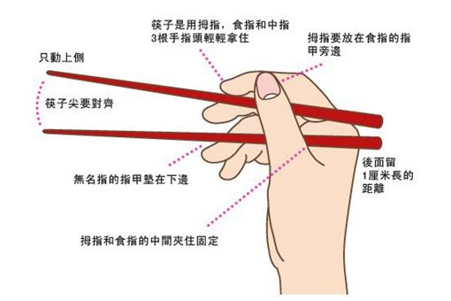

* 筷子的寓意

筷子长七寸六（1寸=3.333厘米），表示人的「七情六欲」（七情：喜怒忧思悲恐惊，六欲：眼耳鼻舌身意），提醒人们要克己复礼，节制欲望。而筷子一头方一头圆，则代表着「天圆地方」, 是古人对世界基本原则的理解。人们手持筷子时，拇指食指在上，无名指在下，中指在中间，就形成了天、地、人“三才之象”。另则筷子在使用时，一根为主动，是为阳；另一根为从动，此为两仪之象，用筷子的五根手指代表五行：金木水火土；用筷子，力气太大打不开，力气过小夹不住，这就告诉我们做事要有分寸和礼节、更应懂得天高地厚。

《周易》中有明八卦：乾、坎、艮[gèn]、震、巽[xùn]、离、坤、兑；暗八卦：休、生、伤、杜、景、死、惊、开。筷子有两根，二对应到八卦中就是“兑”卦，意为“口”；筷子本身直，长对应八卦的“巽”卦，意为“入”。
  

