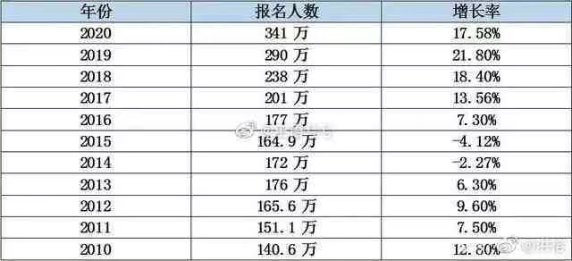
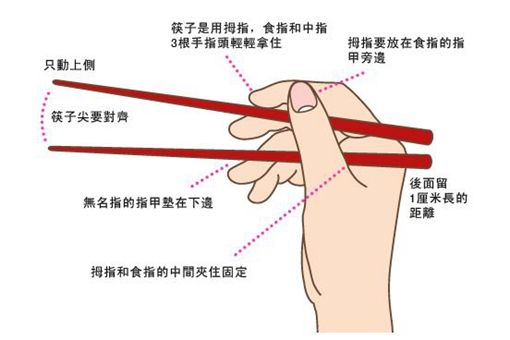
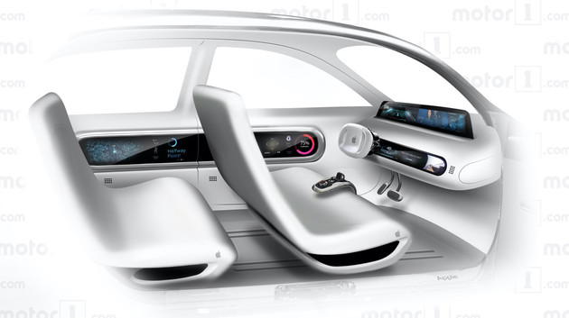
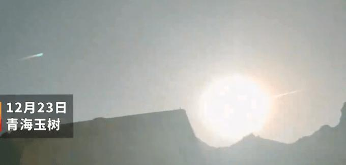
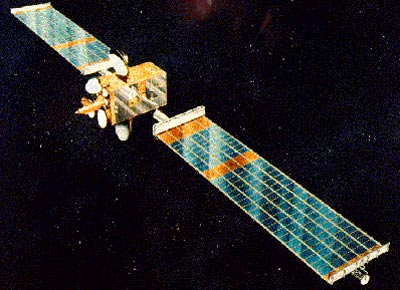
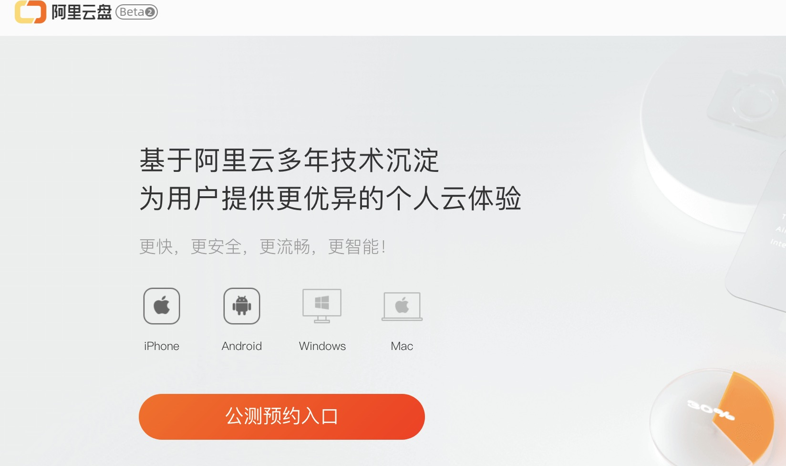

* 2020年考研人数突破300w

  2020年研究生报考人数突破300w，是2015年的2倍，高达341w。一方面，中国人口红利吃了几年了，企业对高精尖人才的需求日益增长，读研可以延缓就业压力；另一方面，高校扩招的政策推行，上大学的门槛越来越低，据不完全统计，初升高的淘汰率接近50%，这意味着一半的初中毕业生无书可读（指普高），而另一半能上普高的学生基本上在3年后较大概率可以继续深造。
* 筷子的寓意

筷子长七寸六（1寸=3.333厘米），表示人的「七情六欲」（七情：喜怒忧思悲恐惊，六欲：眼耳鼻舌身意），提醒人们要克己复礼，节制欲望。而筷子一头方一头圆，则代表着「天圆地方」, 是古人对世界基本原则的理解。人们手持筷子时，拇指食指在上，无名指在下，中指在中间，就形成了天、地、人“三才之象”。另则筷子在使用时，一根为主动，是为阳；另一根为从动，此为两仪之象，用筷子的五根手指代表五行：金木水火土；用筷子，力气太大打不开，力气过小夹不住，这就告诉我们做事要有分寸和礼节、更应懂得天高地厚。

《周易》中有明八卦：乾、坎、艮[gèn]、震、巽[xùn]、离、坤、兑；暗八卦：休、生、伤、杜、景、死、惊、开。筷子有两根，二对应到八卦中就是“兑”卦，意为“口”；筷子本身直，长对应八卦的“巽”卦，意为“入”。
  

* Apple要造新能源汽车

 据悉台湾经济日报爆料Apple（苹果公司）电动汽车计划于2021年第三季度正式发布，随后路透社又爆料：苹果将于2024年左右推出新能源电动汽车。在2015年《华尔街日报》的一则报道就曝光了苹果的泰坦计划，这项计划就是为了研发整车；2017年，苹果就获得了加州DMV的许可，可以测试自动驾驶汽车。涉足智能汽车这种新兴产业，苹果给人的感觉更像是起了个大早，赶了个晚集。
 

* 青海玉树疑有天外陨石坠落

  实际上每天平均都有大量的天外天体进入大气层，其总重量要以十吨来计算，包括小行星、彗星、人造航天器的残骸等等。但是绝大多数的这些天体都因为体积小、速度快，在到达地面之前就燃烧没了，能够被我们看到，还能留下陨石的是非常幸运的一件事。
  那么流星雨会撞上人造卫星吗？
  答案是肯定的。尽管这种机率很小，太空浩瀚无垠，我们也可以通过程序控制来规避这种风险。但是就有这么一个倒霉蛋可能是被流星击中的。这就是在1993年“遇袭”的欧洲航天局通信卫星奥林匹克斯（Olympus-1）
   

* 阿里网盘

  BAT三家之中的阿里如今也要上线网盘，现在只上线了手机端（ios和android），电脑端和网页均未支持，下载地址：https://www.aliyundrive.com/。百度网盘最大的缺憾就是非会员下载限速，而阿里网盘目前看来上传下载不限速、免费原画质（倍速）播放，吊打百度网盘。
  阿里网盘内侧预约开启有一段时间，邀请码：yunpan或者l7sb7p。
 
